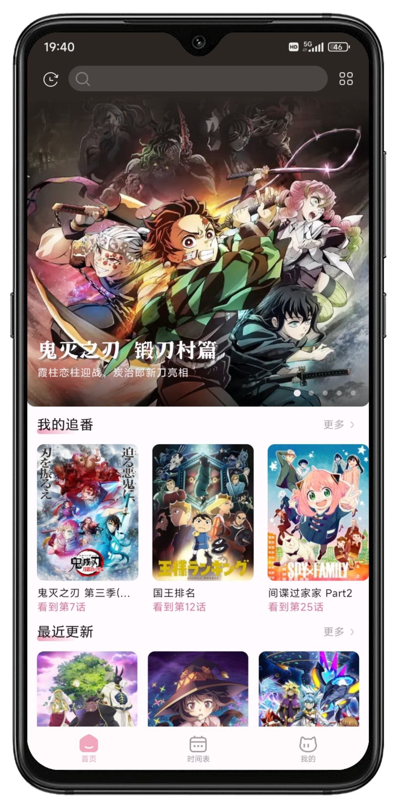
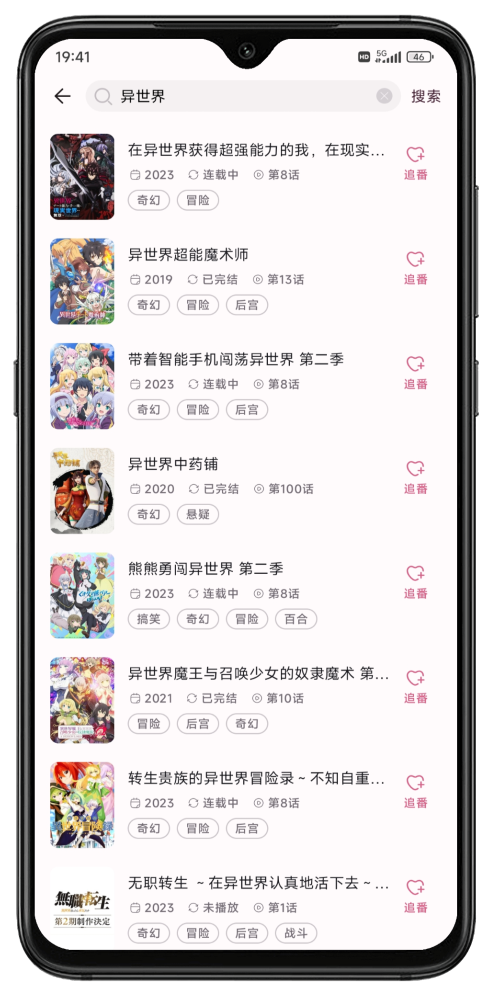
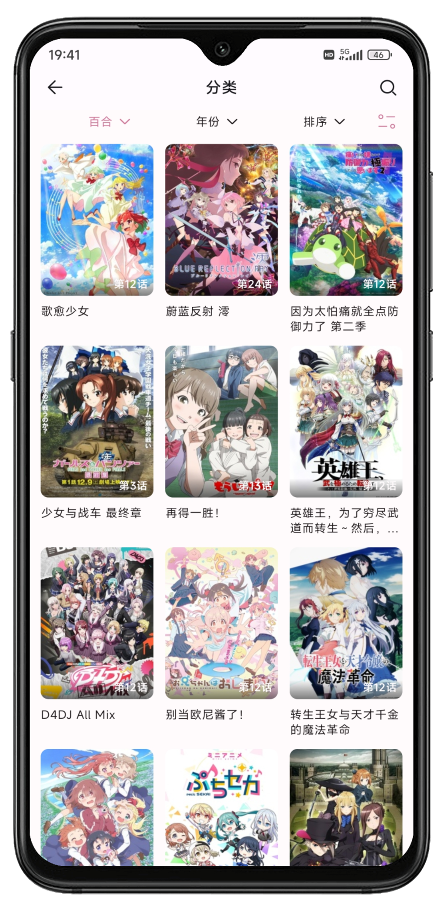
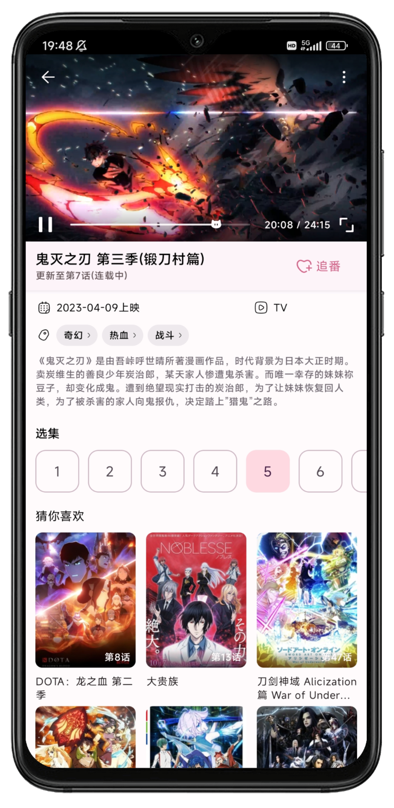
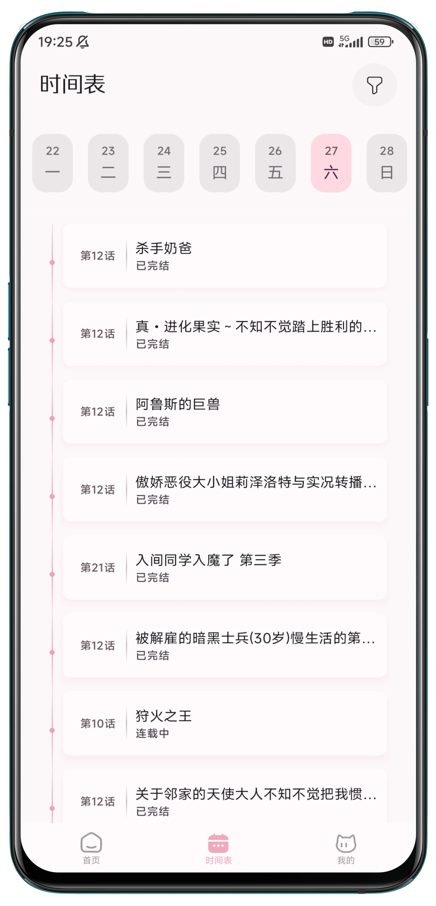

<h1>Neko Anime</h1>

一个可以在线看番的 Android App

## 介绍

Neko Anime 使用樱花动漫「[🌸Ⅰ](http://www.yinghuacd.com/)│[🌸Ⅱ](https://www.yhdmz2.com/)」作为数据源，灵感来源于项目 [Imomoe](https://github.com/androiddevnotesforks/Imomoe)。技术栈方面采用了 Kotlin 搭配 Jetpack Compose，遵循了官方指南中的“[现代 Android 应用架构](https://developer.android.com/topic/architecture)”最佳实践。同时，为尽可能地提高用户体验，Neko Anime 在 UI/UX 设计上广泛借鉴了相关优秀 app。

由于本项目**并不是**由一个拥有丰富经验的开发者从 0 到 1 构建起来的，更准确地讲是一个初学者的练习项目，所以肯定存在些许不成熟、不规范或有待改进的地方，欢迎在 [Issues](https://github.com/xioneko/neko-anime/issues) 中讨论 ☺️。

App 的开发仍在进行中 🚧，可在 GitHub 上 [⬇️下载最新版本](https://github.com/xioneko/neko-anime/releases)

### 功能特色

- 海量番剧在线观看，无任何广告
- 丰富的搜索和分类检索功能，快速找到你想要观看的番剧
- 新番动态展示，以及每日更新表
- 一键追番，收藏你喜爱的番剧
- 本地观看历史，以及播放进度记忆
- ...

### 应用截图
| 首页                                | 搜索                             | 分类                           | 播放                            | 时间表                             |
|-------------------------------------|-------------------------------------|---------------------------------|-----------------------------------|-------------------------------------|
|  |  |  |  |  |

## 技术特性
 - 参考了[官方指南](https://developer.android.com/topic/architecture)，并借鉴了项目 [nowinandroid](https://github.com/android/nowinandroid/) 的架构设计，UI Layer、Domain Layer 和 Data Layer 三层分离。
 - Data Layer 层使用了 Room (database)、Retrofit (http client)、jsoup (HTML 解析器)、jetpack datastore (数据存储)、kotlinx-serialization (数据结构化/序列化) 以及 store5 (“离线优先”解决方案)
 - UI Layer 层基于 Jetpack Compose，使用了 media3 (视频播放器)、coil (图片异步加载) 和 lottie-compose (矢量图形动画)，并在 Accompanist 的支持下实现了 navigation compose 动画以及对 Systerm UI 的控制
 - 使用 Hilt 实现依赖注入
 - ...

## 构建
- Android Studio Flamingo | 2022.2.1
- compileSdk 33
- Gradle JDK 17

## 更新日志

### v0.1.3 (2023-6-13)
**缺陷修复**
- 播放页动漫信息不更新的问题
### v0.1.2 (2023-6-6)
**改进功能**
- 支持 Android 11
- 在搜索结果页使用系统返回键只会返回到历史搜索页

**缺陷修复**
- 视频源 www.yinghuacd.com 无法使用的问题
- 视频源 m.yhdmz2.com 偶尔不可用的问题
- App 直接退出导致播放记录无法保存的问题
- 获取番剧信息时的集数解析问题

### v0.1.1 (2023-5-27)
**改进功能**
- 图片加载失败显示占位图
- 时间表页若数据获取异常给予反馈

**界面优化**
- 播放界面番剧信息展示布局
- “时间表”和“我的”界面背景色

**缺陷修复**
- 启动屏滞留时间过短
- 网络不可用时 Snackbar 不弹出
- 番剧播放界面的系统状态栏外观问题
- 获取番剧信息时，图片地址识别问题
- 播放器播放状态改变问题

### v0.1.0 (2023-5-24)
- 第一个发布版本，大多数功能基本实现
- 待实现功能包括但不限于，番剧下载、明亮/暗黑模式切换、个性化番剧推荐、触摸滑动改变播放时间条。

## FAQ
- **番剧数据加载失败了怎么办？**

  目前 App 使用的番剧信息数据全部来自于 https://www.yhdmz2.com/ ，请检查该网站是否可以访问，若无法访问可在 [GitHub Issues](https://github.com/xioneko/neko-anime/issues) 中反馈。

- **视频加载失败了怎么办？**

  目前 App 以 http://www.yinghuacd.com/ 作为主视频源，以 https://www.yhdmz2.com/ 作为备用视频源
  - 对于主视频源，需要指出的是，App 内部在从主视频源请求视频地址的时候，使用的是备用视频源网站获取的番剧名，而不是某一固定统一的番剧ID，因此会有一定概率失败
  - 对于备用视频源，App 会请求其提供的前两个视频线路，并且优先使用线路1，如果出现加载超时，再切换成线路2

## 许可证

[GNU General Public License v3.0](https://www.gnu.org/licenses/gpl-3.0.html)

## 免责声明

1. 此软件所展示的所有内容均来自互联网。
2. 此软件只提供服务，不存储、不制作任何数据内容，不承担任何由于内容的合法性及健康性所引起的争议和法律责任。
3. 若此软件收录的内容侵犯了您的权益，请联系邮箱 [stnecat@gmail.com](mailto:stnecat@gmail.com)。
4. 此软件仅可用作学习交流，不得用于商业用途。
